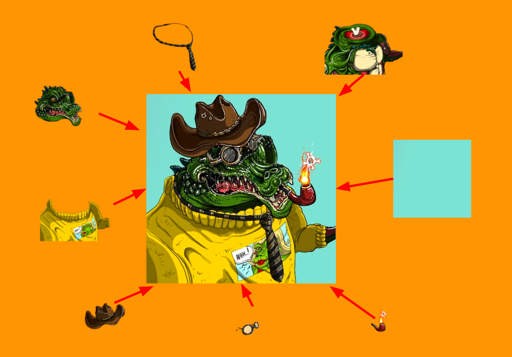

# Camo Crocs NFT Engine


[Video Tutorial](https://www.youtube.com/watch?v=woOy6FPraSw)

### Links to Camo Crocs and my other NFTs

[Camo Crocs on Magic Eden](https://magiceden.io/marketplace/camo_crocs)

[Camo Crocs: Signature Edition on Magic Eden](https://magiceden.io/marketplace/camo_crocs_signature_edition)

[Camo Crocs & Doodle Crocs Website](https://camocrocsnft.com/)

[Discord](https://discord.gg/kPrANwezF3)

[Twitter](https://twitter.com/camocrocsnft)

### NFTs that have used this engine (w/o modifications)
1. [Camo Crocs](https://discord.gg/kPrANwezF3)
2. [Doodle Crocs](https://discord.gg/kPrANwezF3)
3. [Furious Formula](https://discord.gg/BuzspKyZST)

## Introduction

Camo Crocs NFT engine is a tool that lets you generate unique combinations of a set of base images and the metadata required to create NFT collections.



The tool is driven by a configuration file (json format), and will not require you to understand the technical side of it. If you do want to get into the technical side, the code is fairly modular and is written in Python, one of the easiest languages to learn. Checkout the video tutorial for additional help.

## Usage
At a high level, here is what you will need to do:
1. Install Python 3.9
2. Download this code
3. Copy your base images into a folder inside the project path
4. Edit config.json to suit your project
5. Run the tool

### Install Python
Any [Python distribution](https://www.python.org/downloads/release/python-390/) should work, but try to stay on version 3.9 as that is the only one tested with this project.

### Setup this code
Easiest option is to hit the Code > Download ZIP button and unzip it. Alternatively, run

`git clone git@github.com:camocrocs/camocrocs_nft_engine.git`

Change to the `camocrocs_nft_engine` directory. Install the dependencies by typing the following in a terminal

`pip3 install -r requirements.txt`

You can verify that the dependencies called out in requirements.txt are installed by typing 
`pip3 freeze`.

### Preparing base images
To help you get started, this project includes a few low resolution versions of base images from Doodle Crocs NFT. You can use these to test the generation of at most 8 images.

While using your own images, organize images for each trait into separate directories, then put all such directories into one directory called layers (you can change this name in the config). For example

```
layers
 - Headgear
   - Cowboy Hat.png
   - Party Hat.png
 - Body
   - Normal.png
 - Face
   - Excited.png  
```

The generated traits will have the folder names as their name and file names (without the extension) as their value.

A typical practice is to assign different weights / rarities to each image so that the combinations favor some traits more than others. You can do this by suffixing your name names with # followed by weight. For example 

```
layers
 - Headgear
   - Cowboy Hat#75.png
   - Party Hat#25.png
 - Body
   - Normal.png
 - Face
   - Excited#0.1.png  
   - Angry#99.9.png  
```

This means, `Cowboy Hat` has 75% chance of being chosen while generating a combination and `Party Hat` has 25% chance. `Excited` has 0.1% and `Angry` has 99.9. You get the idea. The rarity delimiter # can be changed in the config file. 

Now, what about the case you may not want a trait to appear at all? For example, what if you happen to have a hand trait that shows up only in 25% of the combinations and not in others? You can do this by creating a blank PNG image and using that as the substitute for the 'no image' case. For example
```
layers
 - Hand
   - None#75.png
   - Finger#25.png
```
You can name the blank image whatever you want and the metadata will contain that value (for example, `"Hand": "None"`). Just make sure that this image is fully transparent and matches the resolution of the other images.

### Edit config
Open config.json, and at a minimum, change the following:
- Under layers, set the correct order in layersInOrder
- Pick the number of images you want in totalImages (this can't be arbitrary value - you need to do the math to make sure the number of traits you have is enough to yield that many combinations)
- Under metadataOptions, customize name, description etc.

All config options are explained in detail later, but this should get you started.

### Run the tool 
In a terminal, run

```
python camocrocs_engine.py
```

You should see output about generating metadata, images after which a series of checks will run and verify the output. A typical successful run will look like this

```
python camocrocs_engine.py 
Parsing config...

Generating unique traits...
Generated 5 traits and confirmed uniqueness

Writing metadata...
Writing 0.json
Writing 1.json
Writing 2.json
Writing 3.json
Writing 4.json

Generating images...
0 generated
3 generated
2 generated
1 generated
4 generated

Verifying generated output...
Checking images
✓ Expected number of files (5) and file names matched
Checking metadata
✓ Expected number of files (5) and file names matched
✓ output/_metadata.json exists
✓ output/_stats.json exists
✓ Found 5 entries in output/_metadata.json as expected
Checking if each metadata file has the expected name, description and all that crap
✓ All checks passed

Done. Check /Users/kv/camocrocs/camocrocs_nft_engine/output for generated output.

**********************************************************************
Thanks for using Camo Crocs NFT engine. Good luck with your project!
**********************************************************************
```

If there is an error, you will likely see some details on what failed during the verification stage.

### Understanding the output
Your output will be in a base directory called `output` in the same folder you ran the tool (unless you changed it in the config). The output structure looks like this 

```
output
 - _metadata.json
 - _stats.json
 _ images/
   - 0.jpg
   - 1.jpg
 _ thumbnails/
   - 0.jpg
   - 1.jpg
 _ metadata/
   - 0.json
   - 1.json
```

The images generated are guaranteed to be unique combinations of your base layers. Thumbnails are optional, and are typically low-resolution replicas of your images. You may want these for promotional purposes. Metadata folder has one json file per image, in the blockchain format set in the config. If you open them up, you will notice that there are entries like this
`"image": "image.jpg"` and `"uri": "image.jpg"` (for Solana). These are placeholder that must be replaced with image links once you upload your images to a storage such as IPFS. The code has some work-in-progress features to make all this easier for you, but these are not fully ready yet.

The `_metadata.json` is an aggregated version of all the metadata generated under `metadata` folder. You don't need this usually but it may come handy in some setups. The `_stats.json` is also informational. It tells you how many times each trait was chosen while generating combinations. If you have different weights for your images (explained earlier), you may want to glance through this to make sure your rarest traits appeared the least.

### Configuration options
Here is everything you can do with config.json.

#### General attributes
```
    "outputBasePath": "output",
    "totalImages": 5,
```
| Attribute | Description |
| --------- | ----------- |
| outputBasePath | Path to the output folder. Can be relative to the directory where you run the tool. |
| totalImages | Total number of images to be generated. This must be a value small enough to allow unique combinations from your base images. For example, if you have 4 headgears, 5 faces, 2 eyewears, with rarities being equal, you can get 4 * 5 * 2 = 40 combinations. If you have unequal weights, this number would be lower. |

#### Layer attributes
```
    "layers": {
        "layersBasePath": "layers",
        "rarityDelimiter": "#",
        "layersInOrder": [
            {"path":  "Background"},
            {"path":  "Face"},
            {"path":  "Eyes"},
            {"path":  "Headgear"}
        ]
    },
```

| Attribute | Description |
| --------- | ----------- |
| layersBasePath | Directory where you have placed the base images. This is a path relative to where you have installed the tool. |
| rarityDelimiter | The character you use to separate image name from its weight. |
| layersInOrder | This is the order in which the images are picked and combined together. The first entry is placed at the bottom, next one above it and so on. You typically want the background layer be the first entry. | 

#### Generated image attributes
```
    "imageOptions": {
        "outputPath": "images",
        "format": "jpg",
        "jpgQuality": 75,
        "width": 300,
        "height": 300 
    },
```
| Attribute | Description |
| --------- | ----------- |
| outputPath | Directory where the generated images are created. This path is relative to `outputBasePath`. |
| format | Format of the generated images. Only `jpg` and `png` have been tested. Keep in mind that your base images must be png always. |
| jpgQuality | If you chose jpg format, this determines the quality of compression. Can be 0 through 100, 100 being the best quality and highest size. Highest quality setting might lead to slower output generation. |
| width | Width of the generated images |
| height | Height of the generated images |

#### Thumbnail attributes
```
    "generateThumbnails": true,
    "thumbnailOptions": {
        "outputPath": "thumbnails",
        "format": "jpg",
        "jpgQuality": 75,
        "width": 128,
        "height": 128
    },
```
| Attribute | Description |
| --------- | ----------- |
| generateThumbnails | Generate thumbnails in addition to generated images. Set to `true` or `false`. |
| outputPath | Directory where the thumbnail images are created. This path is relative to `outputBasePath`. |
| format | Format of the thumbnail images. Only `jpg` and `png` have been tested. Keep in mind that your base images must be png always. |
| jpgQuality | If you chose jpg format, this determines the quality of compression. Can be 0 through 100, 100 being the best quality and highest size. Highest quality setting might lead to slower output generation. |
| width | Width of the thumbnail images |
| height | Height of the thumbnail images |

#### Metadata attributes
```
    "metadataOptions": {
        "outputPath": "metadata",
        "format": "solana",
        "name": "Doodle Crocs",
        "description": "Doodle Crocs is another collection from The awesome Camo Crocs family of NFTs. Camo Crocs is available on Magic Eden.",
        "externalUrl": "https://magiceden.io/marketplace/camo_crocs",
        "extras": {
            "symbol": "CROC",
            "seller_fee_basis_points": 500,
            "edition": 0,
            "creators": [
              {
                "address": "your_wallet",
                "share": 50
              },
              {
                "address": "your_partner_wallet",
                "share": 50
              }
            ]
        }
    },
```
| Attribute | Description |
| --------- | ----------- |
| outputPath | Directory where the metadata files are created. This path is relative to `outputBasePath`. |
| format | Blockchain where you intend to deploy. of the thumbnail images. Only `jpg` and `png` have been tested. Keep in mind that your base images must be png always. |
| name | NFT name. This will be suffixed with the token number. For example, Camo Crocs #0 will be the name of the first token generated. |
| Description | You know what it means. It is better to avoid calling out the total images in your collection here because you may end up cutting down your supply later on. |
| externalUrl | A link to your website or anything else related. You can leave it blank. |
| symbol | Needed for Solana. A short symbol representing your project, such as CROC |
| seller_fee_basis_points | Needed for Solana. Some marketplaces use this to pay you royalty when your NFT is traded. The unit is the percentage of royalty multiplied by 100. For example, 500 is 5%. |
| edition | Needed for Solana. Used to group a series of projects together. You can leave it to the default. |
| creators | Needed for Solana. A set of `address` and `share` pairs that determines how the the secondary sale royalty gets split between your team members. `address` is the Solana wallet and `share` is a % that wallet gets. The shares must add up to 100. | 

#### Runtime attributes
```
    "runtime": {
        "useConcurrency": true,
        "useRandomSeed": false,
        "randomSeed": 14015075
    }
```


| Attribute | Description |
| --------- | ----------- |
| useConcurrency | Decides whether to generate multiple images and metadata concurrently. Can be `true` or `false`. If set to `true`, the tool will finish faster but you will see images being generated out of order. |
| useRandomSeed | By default, you will get random images with each run of the tool. If you prefer that you get a repeatable random collection each time you run, set this to `true` and set `randomSeed` to any random number like you see here. After this, you will see the same set of images being generated each time you run. |
| randomSeed | Used only if `useRandomSeed` is `true`. This can be any random value that will be used to set the initial state of the random generator. | 

#### Experimental: Metadata update attributes
```
    "metadataUpdateOptions": {
        "imageUris": "_imageuris.csv"
    },
```
This feature is still not complete but mentioning it anyway if you are wondering what it is. When you generated the collection, these image links were set to a default value such as `image.jpg` and will need to be updated later. In a typical NFT development flow, you generate the collection and upload it to a storage such as IPFS or arweave. After this, you update your metadata files to point to the image links that resulted from the upload. This work-in-progress feature allows updating these links from a CSV file. The relevant code is in `metadata_updater.py` but has not been integrated with the engine yet.

| Attribute | Description |
| --------- | ----------- |
| imageUris | Path (relative to `outputBasePath`) to a CSV file of the format tokenId,imageUri. Image URI can be a URL or an IPFS CID. If it does not contain something that looks like a URL, it will be treated as IPFS hash and will be prefixed with `https://ipfs.io/ipfs/`. 

### How do I get support?
You can file an issue through github. You can also find me on Discord through my id `ArtOfWar | Camo Crocs#4573`. I get a lot of spam DMs (who doesn't, it's Discord) so the easier way to get my attention is to go to my Camo Crocs server (links in the first section) and find me there.

### That's it, folks!
Happy minting! Hope you find the tool useful. If you want to support this effort, you do so by 
- Checking out my NFT collections and buying some
- Spreading the word about my projects on your social media to give them more visibility in secondary market
